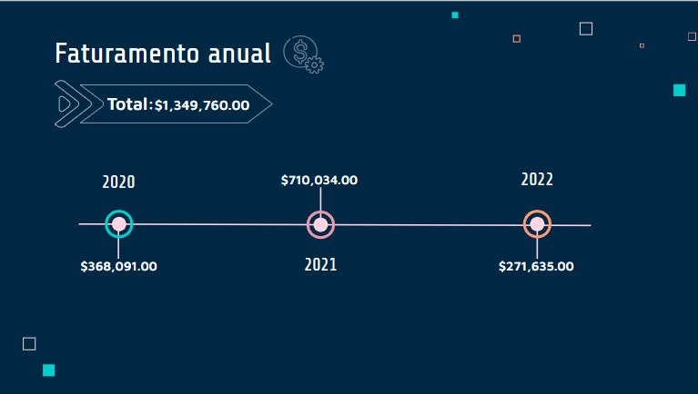
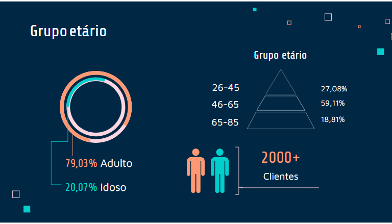
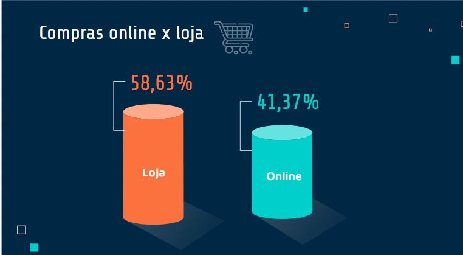
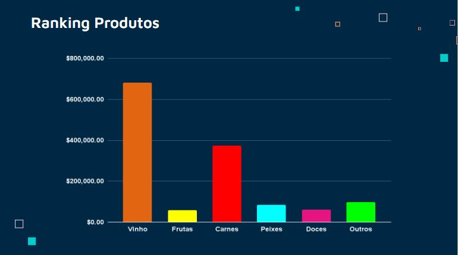
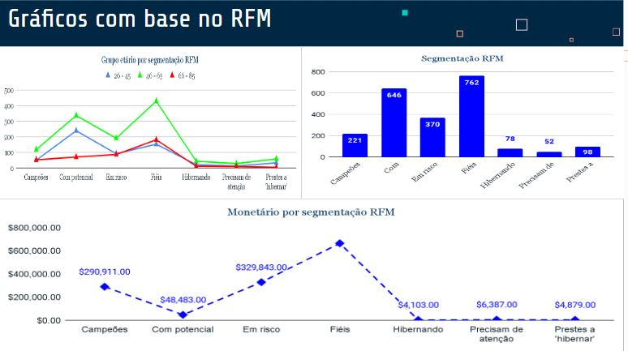

<h1 style="font-size: 24px;">Segmentação</h1>

**Contexto**
O Mercado enfrenta dificuldades de adaptação às novas preferências dos seus clientes e não tem uma estratégia eficaz para segmentar a sua base de clientes. Isto levou a uma perda de oportunidades de vendas e a um investimento ineficiente em marketing. Para a empresa, é fundamental abordar esses desafios para alcançar o crescimento sustentável, maximizar a lucratividade e identificar onde investir esforço.

**Objetivo**
Analisar as vendas e segmentar a base de clientes da loja "El Mercado" através da metodologia RFM (Recência, Frequência e Valor Monetário).

Adicionalmente, buscar informações importantes que estão ocultas nos dados, como por exemplo: Quem são esses clientes? Estão casados? Têm filhos? Quantos anos têm? Qual é o volume de vendas da empresa (em quantidade)?

**Insumos**

- Conjunto de dados com informações de clientes registrados entre 2020 e 2022
- Conjunto de dados com informações das transações realizadas pelos - - clientes entre 2020 e 2022
- Conjunto de dados com o resumo das compras (artigos) realizadas pelos clientes

**Ferramentas**

- Google Sheets
- Google Slides
- Looker Studio
- Loom

### Etapas do Projeto

- Processar e preparar os dados.
- Fazer uma análise exploratória (AED).
- Aplicar técnicas de análise.
- Construção de dashboard.
- Apresentação de resultados para as partes interessadas.

